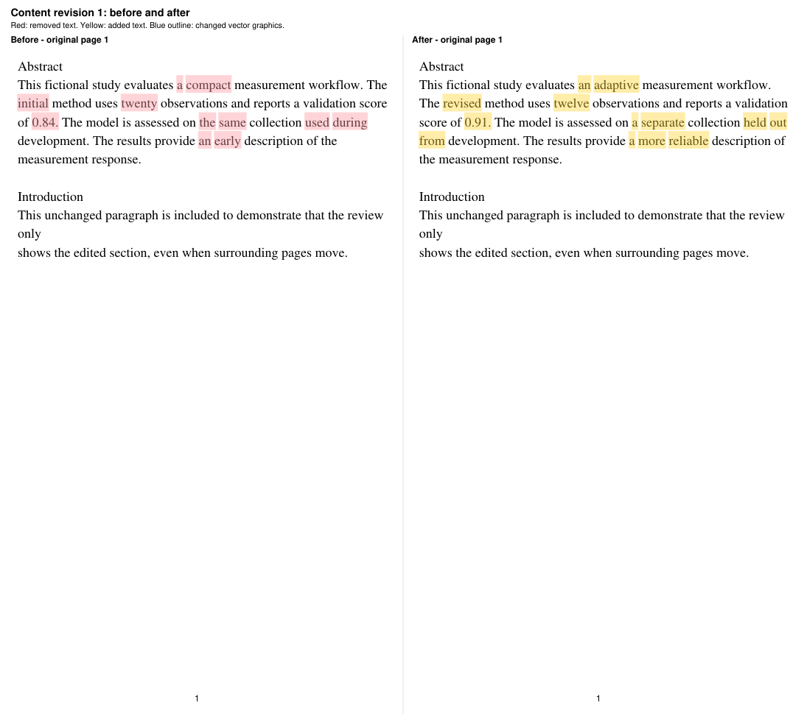

# PDF Content Diff

**A compact visual review of the words that changed.**

[](https://github.com/Sang-Hyorin/pdf-content-diff/actions/workflows/ci.yml)
[](LICENSE)
[](requirements.txt)

[中文说明](README.zh-CN.md) · [Download VSIX](https://github.com/Sang-Hyorin/pdf-content-diff/releases)

PDF revisions often shift line numbers, line breaks and page boundaries.
PDF Content Diff compares extracted text across the document, then places the
actual edits on complete original pages in a clean side-by-side review PDF.



**Red** marks removed or replaced text. **Yellow** marks added or replacement
text. The example is fictional and contains no private manuscript material.

## What it does

- Compares the whole document before selecting changed regions for review.
- Filters detected manuscript margin line numbers and centered page numbers.
- Reconciles line-end hyphenation and substantial exact text movement.
- Preserves small numeric edits, punctuation and case changes.
- Keeps PDF text and vectors sharp and selectable; it does not rasterize pages.
- Runs locally or on a VS Code Remote SSH host without an external API.
- Caches comparisons by source hashes and implementation fingerprint.
- Leaves both source PDFs unchanged.

## Quick start

Use Python 3.9 or newer:

```sh
python -m venv .venv
# Linux/macOS: source .venv/bin/activate
# Windows PowerShell: .venv\Scripts\Activate.ps1
python -m pip install -r requirements.txt
python build_comparison.py older.pdf newer.pdf comparison.pdf
```

Open `comparison.pdf` in any PDF reader. It contains complete changed pages at one document-wide scale. If there are no text changes, it says so on one page.
Each review sheet holds at most one complete page per side. Extra pages continue on new sheets.

For a machine-readable result with source-coordinate rectangles:

```sh
python backend.py older.pdf newer.pdf > changes.json
```

## VS Code

1. Download the VSIX from a GitHub release, or build it with
   `python scripts/package_vsix.py dist/pdf-content-diff.vsix`.
2. In VS Code, run **Extensions: Install from VSIX** and choose that file.
3. Install a PDF viewer, such as `mathematic.vscode-pdf`, for in-editor preview.
4. Set `pdfContentDiff.pythonPath` to a Python executable with PyMuPDF installed.
5. Run **PDF Content Diff: Compare Two PDFs**, or right-click a PDF in Explorer.
   Choose the older file first, then the newer file.
6. Use **PDF Content Diff: Compare Last Pair** to rerun that pair.

The result is saved beside the newer PDF as `<name>_content_comparison.pdf`.
This generated comparison is refreshed if either source changes. An unrelated
file at that output path is never overwritten; choose another output with the
CLI or rename the unrelated file first.

For **Remote SSH**, install the VSIX on the remote host and configure the
**remote** Python interpreter. Only the small generated review PDF needs to
be opened by the client. Python dependencies are not bundled in the extension.
This project has not been published to the VS Code Marketplace.

## Scope and limitations

This is a **text change** tool, not a pixel diff. It does not detect raster-image-only, font or layout edits, and it does not perform OCR. Complex
multi-column reading order, rotated pages and mathematical glyph extraction can
produce imperfect alignment. Review important equations against the source.

Line-number and page-number detection uses positional heuristics. Alphabetic
hyphens are normalized, so a change consisting only of a hyphen may be ignored.
Exact moved text is suppressed when it meets the movement threshold. Complete pages include unchanged text and graphics as context. Only changed words are highlighted.

The current layout targets research manuscripts. It uses a landscape review
sheet with a single common scale for all source pages; use your reader's zoom for detail. No claim of universal semantic equivalence is made.

## Development

```sh
python -m unittest discover -s tests -v
node --check extension.js
python examples/make_demo.py
python scripts/package_vsix.py dist/pdf-content-diff.vsix
```

The demo creates synthetic input PDFs and a vector comparison in `build/demo`.
The backend uses PyMuPDF for extraction and rendering, and Python's
`difflib.SequenceMatcher` for token alignment. There is no model download,
API key or network call in the comparison code.

## License

Copyright 2026 PDF Content Diff contributors. Released under **AGPL-3.0-only**; see [LICENSE](LICENSE).
The project uses [PyMuPDF](https://github.com/pymupdf/PyMuPDF), whose open-source
distribution is AGPL v3. See the dependency's
[licensing information](https://pymupdf.io/licensing) for its available licenses.

Contributions and reproducible synthetic bug reports are welcome.

## Automatic refresh

After comparing two PDFs, the extension watches both inputs and rebuilds the review after writes settle (default 1.5 seconds). Keep the review open in the recommended PDF viewer; it reloads when the generated PDF is replaced. Background refresh does not steal focus. The last pair is restored when the same workspace reopens. Disable `pdfContentDiff.autoRefresh` or adjust `pdfContentDiff.refreshDelay` in Settings. LaTeX must still compile the revised source PDF. Source PDFs are never modified.

## Vector graphics and compact layout

Vector drawing geometry, stroke and fill changes are outlined in blue. Identical translated drawing groups are reconciled across pages. Dense pages with more than 2,000 paths are compared as a single group; independent figure movements on those pages may be flagged. Raster image changes, text rendered inside images, clipping-only changes and transparency-group effects are not covered. Both documents share one content-bounds crop, derived from all pages rather than edited regions. Outer whitespace is trimmed, body text retains its original point size, and every sheet has the same dimensions.
